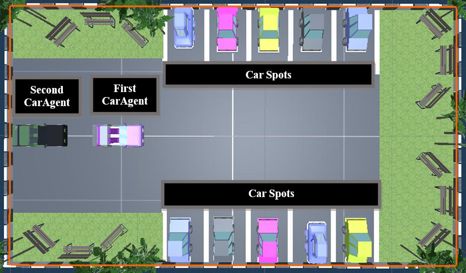
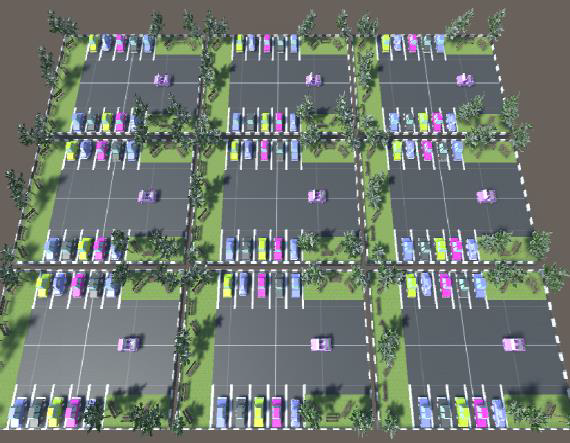
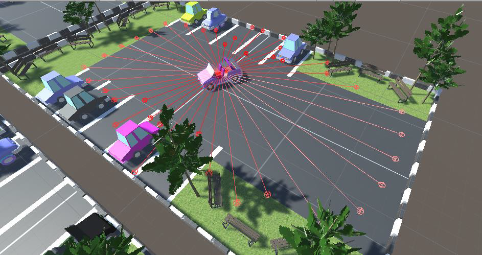
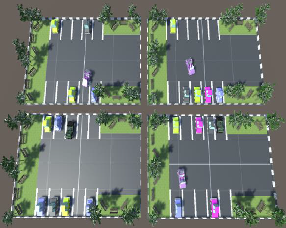
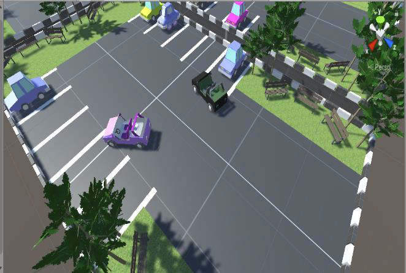

# AI Parking Agents in 3D Parking Lot

## Abstract

The purpose of this project is to develop AI agents (cars) capable of learning how to park in a 3D parking lot. The implementation leverages Unity's ML-Agents framework and utilizes deep neural networks trained with the Proximal Policy Optimization (PPO) algorithm. The project begins with a simple model featuring a single agent, and through code enhancements, it becomes possible to scale up the number of agents.

## Problem Statement

This project addresses the challenge of teaching AI agents how to park in a 3D environment. It comprises two distinct scenarios designed to be flexible and expandable to accommodate additional agents:

### Scenario 1: Single-Agent Parking

In the first scenario, only one car is placed in the environment. The car is trained to park in an available parking lot. Notably, the car's initial position changes randomly at the start of each episode. Moreover, the number of available parking lots and their positions vary randomly between a specified minimum and maximum in every episode. Consequently, in each episode, the car learns to solve a different problem by encountering a new configuration of the environment.

### Scenario 2: Multi-Agent Parking

In the second scenario, two agents are situated in the environment. Both agents are trained to park in a parking environment with more than two free parking lots. Similar to the single-agent scenario, the initial positions of both cars change randomly at the beginning of each episode, and the number of available parking lots and their positions are adjusted in every episode.

## Features

- Implementation using Unity's ML-Agents framework.
- Deep neural networks trained with the Proximal Policy Optimization (PPO) algorithm.
- Flexible scenarios that can be extended to accommodate more agents.
- Randomization of car positions and parking lot configurations to promote adaptability.
